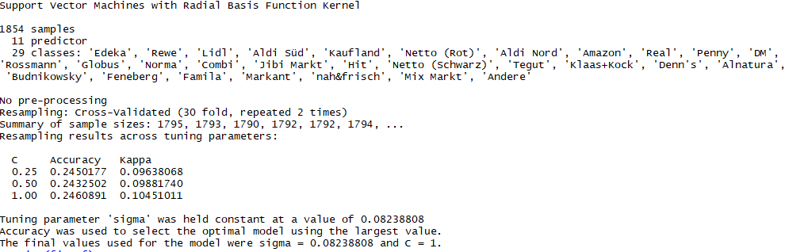

<div class="mycontent">

```{r setup, include=FALSE}
knitr::opts_chunk$set(echo = TRUE)
options(warn=-1)
options(Encoding="UTF-8")
```

```{r, echo=FALSE,results='hide', message=FALSE} 
# Packages
if (!require("haven")) install.packages("haven") 
if (!require("devtools")) install.packages("devtools") 
if (!require("fs")) install.packages("fs") 
if (!require("devtools")) install.packages("devtools") 
if (!require("ggbiplot")) install_github("vqv/ggbiplot") 
if (!require("factoextra")) install.packages("factoextra")
if (!require("Rtsne")) install.packages("Rtsne")

library(haven)
library(tidyverse)
library(dplyr)
library(tidyr)
library(ggplot2)
library(hrbrthemes)
library(viridisLite)
library(viridis)
library(plotly)
library(reshape2)
library(caret)

#Dataset Load
# customerdata <- read_sav(choose.files())
#customerdata <- read_sav("D:\\Study\\OVGU\\DSwR\\Datensatz PASCAL_EP_18.02.20.sav")
customerdata <- read_sav("~/VersionControl/Git/DataScienceWithR---Market-Research/ProposalMarkdown/MarketData.sav")

# File Imports
path = getwd()
DatasetInspection <- read.csv(paste0(path,'/DataFrames/DatasetInspection.csv'))
FilteredBasicDF <- read.csv(paste0(path,'/DataFrames/BasicIndividualGroupsSatisfactionClustersWithFiltered.csv'))
CompleteBasicDF <- read.csv(paste0(path,'/DataFrames/BasicIndividualGroupsSatisfactionClustersComplete.csv'))
```

&nbsp;

## Introduction :
As a part of our course Datascience with R, we are working on a Business problem, in order to enhance our R programming skills and explore various libraries and improve our Visualization techniques. We are working on IWD dataset which comprise of responses of Customers in likert scale for over 35 questions divided over 10 Blocks.

* **Problem Statement**- Improving customer Loyalty towards their supermarket.In the process of overcoming or solving the problem we have followed few methods.
  + Customer Segmentation With respect to Customer Satisfaction.
  + Customer Segmentation using Demographic data.
  + Customer Satisfaction Index.
  + Recommendation Potential

## Customer Segmentation With respect to Customer Satisfaction:

&nbsp;

### Dataset Features Description:

From the dataset we singled out *Block-6* which contains Individual Satisfaction of Groups and *Block-7* which contains Individual Satisfaction of Branches , which is related to customer satisfaction on the individual Product groups and services provides by the supermarket respectively .

* Block-6 Contains 17 questions on Customer's Satisfaction on Individual Product Groups.

* Block-7 Contains 10 questions on Customer's Satisfaction on Branch factors like Employee service , Cash Register Service , Ambience etc

&nbsp;

### Detailed discussion about Block -7:

In this section we will be analysing the 17 Questions (80 features) present in the *Block-6* In 2 approaches:

* Considering all the *Features*

* Analysis by removing majority *NA* Columns.

&nbsp;

### 1.Considering all the *Features*:

* There are total 17 questions(with 80 features). Each question is divided into sub questions which are answered in the range of 1 to 5 i.e 
  + Very dissatisfied
  + Rather dissatisfied
  + Partly 
  + Rather satisfied
  + Very satisfied
  
* As the question related to Bio contains *NA's* , we had to removed the entire question.

#### Approach: 

* Filled all the *NA's* with column Mean.
* To group these subquestion into a single question we are calculating the mean value of each data point which is the part of these sub questions , because we observed that the customers gave similar ratings to the subquestions under each question.


Further ,we planned to use Kmeans algorithm on the questions, to obtain optimum clusters we used Elow Method on the 16 feature dataset and we got k=2 as optimum kas seen from the graph below.


We performed Kmeans with K=2 and plotted a bar plot which shows the segmentation of the customers who are homogenious on x axis we have Features and on y axis we have cluster results.

&nbsp;

* *The chart below represents the feature (i.e. Questions) boxplots of samples of cluster 1.*
  + We clearly see here that the range of values (or ratings) for most questions lies within 4 to 5, reflecting the answering pattern of the customers. The customers preferred to give similar ratings for all the involved questions. 
  + Please note that the dots in the boxplots represent the outliers and are not taken into consideration for this analysis.
</div>

<div class="initfigs"> 
```{r , fig.align='center',echo=FALSE , warning=FALSE , fig.width=15}


fil1<- CompleteBasicDF %>% filter(CompleteBasicDF$INdividualSatisfactionClustersk2==1)

dfmelt<- melt(fil1, measure.vars = 3:ncol(fil1))

p <- ggplot(dfmelt, aes( variable, value, fill = variable)) + 
  geom_boxplot(size = 1) + 
  ggtitle(" Interactive BoxPlot of Customers Segmentation in 1st Cluster")

# Need to modify the plotly object to make sure line width is larger than default
fig <-ggplotly(p)

# fig$data <- lapply(fig$data, FUN = function(x){
#   x$line = list(width = 10)
#   return(x)
# })

fig

```
</div>
<div class="mycontent">

 
&nbsp;

* *The chart below represents the feature (i.e. Questions) boxplots of samples of cluster 2.*
  + Similar to the cluster 1, the customers under cluster 2 showed a similar pattern of answering questions, except that, here the majority ratings fall between 3.5 to 4.5.

</div>

<div class="initfigs"> 
```{r , fig.align='center',echo=FALSE , warning=FALSE , fig.width=15}


fil2 <- CompleteBasicDF %>% filter(CompleteBasicDF$INdividualSatisfactionClustersk2 ==2)

dfmelt<- melt(fil2, measure.vars = 3:ncol(fil2))

p <- ggplot(dfmelt, aes( variable, value, fill = variable)) + 
  geom_boxplot(size = 1) + 
  ggtitle("Interactive BoxPlot of Customers Segmentation in 2nd Cluster")

# Need to modify the plotly object to make sure line width is larger than default
fig <- plotly_build(p)

fig$data <- lapply(fig$data, FUN = function(x){
  x$line = list(width = 10)
  return(x)
})

fig

```
</div>

<div class="mycontent">

* From the above plots it is clear that most of the customers preferred not to give low ratings to the questions, thus there is bias towards high ratings. This can be further concluded from the statistical summary of each feature as given below.

```{r , echo=FALSE ,warning=FALSE}

summary(CompleteBasicDF[,c(-1,-2)])

```

&nbsp;

### 2.Filtering the *Features*: 

* From all the 18 Questions we are checking the count of total responses given by the customers

* Checking *Non-NA* responses in block
</div>

<div class="initfigs"> 
```{r  ,fig.align='center',echo=FALSE , warning=FALSE , fig.width=14}

fig <- plot_ly(DatasetInspection, x = ~names, y = ~count, type = 'bar',
               text = ~count, textposition = 'auto',
               marker = list(color = 'rgb(158,202,225)',
                             line = list(color = 'rgb(8,48,107)', width = 1.5)))
fig <- fig %>% layout(title = "Non NA's in the Questions",
                      xaxis = list(title = "Product Groups"),
                      yaxis = list(title ="Count of Non-NA's" ))

fig

```
</div>

<div class="mycontent">

From the above plot we can see that the Maximum *Non-NA* count is **2303** and minimum is **468**.The questions *AlcoholicDrinks ,'Cosmetics', 'Organic', 'Snacks', 'Utensils', 'Vegan'*, have significantly less count of non zeros. We are eleminating the Groups which are less than 1152 data points. Why..? Because more than 50% of the rows in these *Question Groups* are *NA's*, therefore in order to understand the influence of these missing values, we removed the columns with large number of missing values and repeated the above analysis. Note that in all the other columns that are not removed, we fill the *NA's* with mean value of those columns. This way we are left with 11 features (questions) in the dataset.

* Elbow method is used for getting optimum clusters.


We performed Kmeans with K=2 and plotted a bar plot which shows the segmentation of the customers who are homogenious on x axis we have Features and on y axis we have cluster results.

&nbsp;

* *Below plot represents filtered Subgroups of customers in the Cluster 1 Homogenious to Customers Satisfaction.*
</div>
<div class="initfigs"> 
```{r , fig.align='center',echo=FALSE , warning=FALSE , fig.width=15}

fil1<- FilteredBasicDF %>% filter(FilteredBasicDF$INdividualSatisfactionClustersk2==1)

dfmelt<- melt(fil1, measure.vars = 3:ncol(fil1))

p <- ggplot(dfmelt, aes( variable, value, fill = variable)) + 
  geom_boxplot(size = 1) + 
  ggtitle("Interactive BoxPlot of Customers Segmentation in 1st Cluster")

# Need to modify the plotly object to make sure line width is larger than default
fig <-ggplotly(p)

# fig$data <- lapply(fig$data, FUN = function(x){
#   x$line = list(width = 10)
#   return(x)
# })

fig

```
</div>
<div class="mycontent">

&nbsp;

* *Below plot represents filtered Subgroups of customers in the Cluster 2 Homogenious to Customers Satisfaction.*

</div>
<div class="initfigs"> 
```{r , fig.align='center',echo=FALSE , warning=FALSE , fig.width=15}


fil2 <- FilteredBasicDF %>% filter(FilteredBasicDF$INdividualSatisfactionClustersk2 ==2)

dfmelt<- melt(fil2, measure.vars = 3:ncol(fil2))

p <- ggplot(dfmelt, aes( variable, value, fill = variable)) + 
  geom_boxplot(size = 1) + 
  ggtitle("Interactive BoxPlot of Customers Segmentation in 2nd Cluster")

# Need to modify the plotly object to make sure line width is larger than default
fig <- plotly_build(p)

fig$data <- lapply(fig$data, FUN = function(x){
  x$line = list(width = 10)
  return(x)
})

fig

```
</div>
<div class="mycontent">
* From the above boxplots, we see that the there is no significant difference in the boxplot patterns of resultant clusters even after removing the features with most missing values. Indicating that these features didn't influence the clustering much. Also, we see that there are again only two clusters obtained, indicating that there are only two customer subgroups in the dataset, also the behaviour of the subgroups is not much different in terms of rating (most ratings are in the high-range 3 to 5).
</div>

<!-- Bhai Till Here -->


<div class="mycontent">
<!-- <center> -->

<!--  -->

<!-- </center> -->
## Customer Segmentation using Demographic data

```{r echo=FALSE}
knitr::read_chunk('../Plots/Demography.R')
```

```{r age, echo=FALSE}
knitr::read_chunk('../Plots/Demography.R')
```

From the graph, we can see that a high number of customers are between the age 46-65 and very few customers of age group less than 25 and greater than 75.

```{r gender, echo=FALSE}
knitr::read_chunk('../Plots/Demography.R')
```

From the barplot, we can see that the number of female customers is higher than male customers but the difference is not significant.


```{r, fig.height=8,fig.width=14,message=FALSE,echo=FALSE,tidy=TRUE, tidy.opts=list(comment=FALSE),income}
```

From the barplot, we can see that there are a lot of customers with income less than 1.250 euros and there is a downward trend as the income goes up the customer count goes down. Many customers are hesitant to mention their income for such cases it is filled with 99 value. This value is not useful for our calculation. We have made an assumption that people with the same age group have similar income. So for customers who are having 99 value, we filled with a mean value of their age group's income.

```{r children, echo=FALSE}
knitr::read_chunk('../Plots/Demography.R')
```


From the graph, it is clear that almost 90 percent of the customers have no children and very few customers have 1 or 2 children.

```{r people, echo=FALSE}
knitr::read_chunk('../Plots/Demography.R')
```


From the graph, we can see that most of the customers have 1 or 2 people in the household. And the trend goes down when the number of people increases.


```{r, fig.height=8,fig.width=14,message=FALSE,echo=FALSE,tidy=TRUE, tidy.opts=list(comment=FALSE),state}
```

From the graph, we can see that the highest number of customers are from state Nordrhein-Westfalen which is around 500 and the lowest are from Bremen which is around 10 customers.


```{r, fig.height=8,fig.width=14,message=FALSE,echo=FALSE,tidy=TRUE, tidy.opts=list(comment=FALSE),silhouette}
```


```{r, fig.height=8,fig.width=14,message=FALSE,echo=FALSE,tidy=TRUE, tidy.opts=list(comment=FALSE),elbow}
```


We have performed K-means clustering on our demographic data.We have figured out the optimal number of clusters by using the Elbow method and silhouette coefficient. From the silhouette graph, we see that the number of optimal clusters can be either 2 or 3 and from the Elbow method we have observed the bend at 4. But in the case of the Elbow method, we can choose the number ofclusters that are close to the bend. So, We consider 3 as the optimal number of clusters. 


```{r, fig.height=8,fig.width=14,message=FALSE,echo=FALSE,tidy=TRUE, tidy.opts=list(comment=FALSE),pca}
```


```{r, fig.height=8,fig.width=14,message=FALSE,echo=FALSE,tidy=TRUE, tidy.opts=list(comment=FALSE),tsne}
```

We have visualized our clustering result using popular dimensionality reduction techniques like PCA and t-sne. From the PCA graph, we can see that the clusters are well separated. But from the t-sne graph we see that there are some overlappings between the clusters even then we can identify the groups easily.

```{r table, echo=FALSE}
knitr::read_chunk('../Plots/Demography.R')
```


```{r incomevsstate, echo=FALSE}
knitr::read_chunk('../Plots/Demography.R')
```


The above graphs don't convey any information about the behavior of the clusters. The above table illustrates the similarity between customers. We have calculated the mean of the numeric data like age, income, number of children, and number of people. As we cannot calculate the mean for the categorical data like State and Gender. From the table, we observe that clusters 1 and 2 have no difference. But by plotting a graph between income and state we have drawn some new insights.

1. Customer group1 has low to average income and they belong to states 1 to 7 (Baden-Württemberg to Hessesn).


2. Customer group2 has low to average income and they belong to states 8 to 16 (Mecklenburg-Vorpommern to Thüringen).

3. Customer group3 are high-income people of all the states.


when decision-makers want to implement a particular strategy. They will focus on a particular subgroup rather than whole customers in general. Because the needs are different for different customers. So, it is a good strategy to group customers based on some common aspects and implements strategies to improve their satisfaction.

***

## Customer Satisfaction Index
### Background
This section focuses on the development of CSI (Customer Satisfaction Index). It evaluates and assesses the dataset from the outlook that helps in comparative analysis of the provided superstores and products. 

As the questionnaire has several sections, the sections that are directly linked to CSI development are from section 11 till section 26. The points or criterion that each section focuses on, are;

1. Range and diversity
2. Price and performance ratio
3. Availability of the product

Moreover, some later sections consider three more criterion to evaluate the superstores and products, and they are;

4.	Quality
5.	Freshness
6.	Presentation


Each section addresses a unique category of products that are available and accessible across all the superstores considered in this questionnaire. The details regarding the sections and the products' categories are as follows;

*	Section 11: This section contains the three common aforementioned questions regarding the products that fall in the category of snacks.
*	Section 12: It covers all the regional products, and asks about their availability, price, and diversity.
*	Section 13: Bio products belongs to this section.
*	Section 14: Vegan products are covered in this section.
*	Section 15: The stores’ own brands (Eigenmarke) are addressed in this section.
*	Section 16: This section covers products that fall in the Marken category.
*	Section 17: It asks about range, performance, and availability of OG products. Also, it asks customers to give feedback on freshness, quality, and presentation of the respective products.
*	Section 18: This section asks all the six aforesaid questions for the products that fall in the BB category.
*	Section 19: The products that belong to Fleisch category cover in this section.
*	Section 20: It address the products related to Wurst.
*	Section 21: Molke related products goes into this section.
*	Section 22: In this section, the questions are asked about Suess products.
*	Section 23: Alkohol products are covered in this section.
*	Section 24: Alkoholfrei products are addressed in this section.
*	Section 25: It asks about range, performance, and availability of Koerperpflege products. Also, it asks customers to give feedback on freshness, quality, and presentation of the respective products.
*	Section 26: It covers Gegenstaende products.

Next comes the scale or measurement criteria. The scale that is employed to gauge each questions in the above said section is called Likert Scale. Likert Scale is most commonly and widely used psychometric scale in questionnaires. In Likert Scale, all the possible options are grouped and normalized on a scale and it (scale) can be of any length. Most commonly used Likert Scale contains either 5 or 7 points scale.

In this questionnaires, for the above mentioned questions, a 5 points scale is used and that is as follows;

1.	Very dissatisfied 
2.	Dissatisfied
3.	Neutral
4.	Satisfied
5.	Very satisfied

### Preliminary Analysis
The previous section discusses the questions and details that are necessary for the development of CSI and measure customers’ satisfaction. This sections highlights the approaches and steps that are the considered in the early analysis of the data. 

Initially we, without performing any preprocessing (dimensionality reduction, for instance), plotted all the superstores and products. Fig. 1 illustrates overall satisfaction level of stores across every product. As it is mentioned in the previous section that each product are being evaluated either using 3 or 6 questions, therefore, this initial plot takes average of all the questions in each product (or section) and plots them against stores. Horizontal axis represents products, vertical axis shows satisfaction level, and the lines represents the stores. In this plot, it is evident from a first glance that majority of the superstores share similar level of satisfaction level. For instance, for product Alokohal the stores except Vmarkt, Combi, and Familia all fall in the range from 4.0 – 4.25 approximately. Similarly, for the other stores the trend suggests that all the stores, except a few, are nearer to each other as they makes a chain. Nevertheless, there are a few stores that stands out in the graph. For instance, if we follow the trend for VMarkt, it has the lowest satisfaction for 5 (Alkohol, Alkoholfrei, BB, Og, and Suess) out of 15 products. Also, graph suggest that the store Andere has the lowest satisfaction level for product Gegenstaende. This plot is helpful in identifying which stores has the high and low satisfaction score in each product, but it is quite cumbersome and too difficult to decode any hidden information, if any.

```{r echo=FALSE}
knitr::read_chunk('../Plots/overall_satisfaction_interactive_II.R')
```

```{r, fig.height=6,fig.width=10,message=FALSE,echo=FALSE,tidy=TRUE, tidy.opts=list(comment=FALSE), overall_satisfaction_interactive_II}
```
<center>
Fig. 1
</center>

We then tried to look at the data from a different angle. Figure 2 uses R’s grid feature in that the stores a grouped in a way that helps in identifying the store the customers are most satisfied with. Horizontal axis represents products and vertical axis shows satisfaction scale. The important aspect of this plot is the usage of gradient color to distinguish different satisfaction levels, and due this approach the plot, at a first glance, gives a sense of Heatmap. Also because of the gradient colors, it is easy to identify any store or product that has low or high satisfaction level as compared to others. For instance, store Andere has the lowest satisfaction score, 3.48, for product Gegenstaende. Also, when comparing store Real with VMarkt, one can easily deduce that customers are more satisfied with Real than VMarkt. This plot, although helps in distinguishing the stores, it still does separate the stores that have high review counts than those having fewer reviews.

```{r echo=FALSE}
knitr::read_chunk('../Plots/stores_satisfaction_grid.R')
```

```{r, fig.height=8,fig.width=14,message=FALSE,echo=FALSE,tidy=TRUE, tidy.opts=list(comment=FALSE), stores_satisfaction_grid}
```
<center>
Fig. 2
</center>

### Dimentionality Reduction

In the last section although we were able to identify some pattern but differentiating the stores that shares the same trend was hard to identify. This section focuses on identifying the hidden patterns in the data. It focuses on reduction of the dimensions so that data can be analyzed more accurately and precisely. To get rid of the data that contributes less and is not informative enough for the analysis, we employed dimensionality reduction approach and in this regard it employees PCA (Principle Component Analysis). This sections performs PCA in two ways. In the first approach it considers all the stores as principle components and plots products across them. Later, in the second approach the same approach is repeated for products where products are principle components and stores are the data points.

Fig. 3, in this plot, principle components refers to products and that is why there are 15 principle components mentioned. Also, in the graph the vectors with red color and caption represents the stores and the labels in black represents the products in the system. This graph gives some important insights about the relation between stores and products. For example, VMarkt, Nahfrish, and Feneberg are correlated as they all grow in similar direction. Similarly, JibiMarkt and Klasskock also are forming a group, and the rest except Tengu, MixMarkt, and Hit growing almost in similar direction and share more information together.

```{r echo=FALSE}
knitr::read_chunk('../Plots/stores_vs_sections_pca.R')
```

```{r, fig.height=8,fig.width=14,message=FALSE,echo=FALSE,tidy=TRUE, tidy.opts=list(comment=FALSE), stores_vs_sections_pca}
```
<center>
Fig. 3
</center>

Similarly, we plotted PCA, Fig. 4, for stores and products and this time we make stores as principle components. This plot also helps in finding out which stores share the information and can be helpful in comparative analysis. For example, Snacks, Gegenstaende, and Vegan are not correlated to the rest of the products.  Similarly, by looking at the stores, it is evident that stores in the 2nd quadrant can be compared with each other, than considering them with the stores like VMarkt and Coop.

```{r echo=FALSE}
knitr::read_chunk('../Plots/sections_vs_stores_pca.R')
```

```{r, fig.height=8,fig.width=14,message=FALSE,echo=FALSE,tidy=TRUE, tidy.opts=list(comment=FALSE), sections_vs_stores_pca}
```
<center>
Fig. 4
</center>

The PCA plots, mentioned above, provide a decent overview about the stores and products that are interconnected and would produce more insight when plotting them together than with those that participates more in different principle component. Therefore, to further dig down through the selection that what stores should be clubbed together, we tried another plots that are as follows.

In this regard, Fig. 5 plots stores and their review count. As evident from the plot that the data is quite imbalance in terms of reviews. Some stores has more review as compared to others, and there is a significant difference between the stores that have more reviews than those that have fewer reviews.

We decided to use a threshold value to split the stores in two sections. The first group would have the stores that have a significant number of reviews, and the second group would have the stores with fewer reviews. But the problem is how to choose the cut-off value. We again referred to PCA plot where stores are chosen as principle components. The clusters there suggests that the stores with reviews’ count lesser than 200 can be grouped together and the rest can be moved to the first group.

```{r echo=FALSE}
knitr::read_chunk('../Plots/stores_vs_reviews.R')
```

```{r, fig.height=8,fig.width=14,message=FALSE,echo=FALSE,tidy=TRUE, tidy.opts=list(comment=FALSE), stores_vs_reviews}
```
<center>
Fig. 5
</center>

Similarly, since the above plot helped in splitting the stores, we repeated the same process for products. And, with the help of this plot, Fig. 6, and the PCA plot, Fig. 3, the cut-off value we came across is 1500. Store with reviews’ count less than 1500 belongs to second group and the rest belong to first group.

```{r echo=FALSE}
knitr::read_chunk('../Plots/products_vs_reviews.R')
```

```{r, fig.height=8,fig.width=14,message=FALSE,echo=FALSE,tidy=TRUE, tidy.opts=list(comment=FALSE), products_vs_reviews}
```
<center>
Fig. 6
</center>


### Detailed Analysis

This section concentrates on the detailed analysis of the stores and products. In the last section we formed groups and split the stores and products in four groups that are follows;

* Group 1: Stores and products have reviews’ count higher than the decided threshold, i.e. 200 for stores and 1500 for products.
* Group 2: Both the stores and products have reviews’ count lower than the threshold.
* Group 3: Stores having reviews’ count higher than 200, and the products having reviews’ count lesser than 1500 belong to this group.
* Group 4: Products have higher reviews’ count but stores have fewer (than threshold) reviews' count. 

The first two plots, Fig. 7 and Fig. 8, plot the stores that have reviews’ count higher than the threshold against both the product groups. These plots use R’s facet_wrap functionality to exploit data patterns and display data in more scattered/grouped form. Each sub-grid in this plot represents a satisfaction level for each individual store against all the available products' categories. Horizontal axis represents product categories, and vertical axis shows satisfaction level for respective products' category in each sub-grid. These plots also do use different colors to plot different satisfaction levels and due to this it is comparatively easy to distinguish the stores that are popular and having better customer reviews. In the first plot, Fig. 7, where all the stores have reviews’ count higher than 200, follow similar pattern. Customers' reviews for Molke was high across every stores, and for Regional its low except for the Real as customers recorded better reviews for it than the rest. Furthermore, by looking at the steepness of the line, store Real and Norma has comparatively less steep trend than the rest. 

In Fig. 8, where the same stores are plotted against the products having lesser reviews' count than 1500, the trend is similar here as well. All the stores have better satisfaction level for Alkohol and relatively negative for Vegan. Contrary to the last plot, Amazon has better satisfaction level as compared to others except Real for which customers seemed to be more satisfied. 

```{r echo=FALSE}
knitr::read_chunk('../Plots/StoresWithHighReview_vs_ProductsWithHighReview.R')
```

```{r, fig.height=8,fig.width=14,message=FALSE,echo=FALSE,tidy=TRUE, tidy.opts=list(comment=FALSE), StoresWithHighReview_vs_ProductsWithHighReview}
```
<center>
Fig. 7
</center>

```{r echo=FALSE}
knitr::read_chunk('../Plots/StoresWithHighReview_vs_ProductsWithLowReview.R')
```

```{r, fig.height=8,fig.width=14,message=FALSE,echo=FALSE,tidy=TRUE, tidy.opts=list(comment=FALSE), StoresWithHighReview_vs_ProductsWithLowReview}
```
<center>
Fig. 8
</center>

Now let’s plot stores and products data for Group 2 and Group 4. Fig. 9 plots stores having reviews' count less than 200 against the products that have reviews' count more than 1500. At a first glance it is evident that some stores have high satisfaction levels than others. Stores Alnatura, Bofrost, Familia, Globus, and Nettoschwarz have satisfaction level above 4.0 for all the mentioned products. At downside store VMarkt, has the lowest satisfaction level as it has no points that are marked as green color. VMarktis followed by store Coop and MixMarkt respectively. The important point that makes this plot different to the plots in the last section, where each product shared almost similar satisfaction level, is, in this plot one can easily distinguish the stores with the help of the satisfaction level. 

Fig. 10 plots data for Group 4. This plot also follows the same trend as last one. Some stores has better satisfaction level. For instance, store Nasfrish and Alnatura has better satisfaction level for each product. The stores that has bad reviews are Andere and MixMarkt. The point that applies to this plot as well is that store can be recommended for all the list product, store Alnatura can be suggest if customer want to by the mentioned products.


```{r echo=FALSE}
knitr::read_chunk('../Plots/StoresWithLowReview_vs_ProductsWithHighReview.R')
```

```{r, fig.height=8,fig.width=14,message=FALSE,echo=FALSE,tidy=TRUE, tidy.opts=list(comment=FALSE), StoresWithLowReview_vs_ProductsWithHighReview}
```

<center>
Fig. 9
</center>

```{r echo=FALSE}
knitr::read_chunk('../Plots/StoresWithLowReview_vs_ProductsWithLowReview.R')
```

```{r, fig.height=8,fig.width=14,message=FALSE,echo=FALSE,tidy=TRUE, tidy.opts=list(comment=FALSE), StoresWithLowReview_vs_ProductsWithLowReview}
```

<center>
Fig. 10
</center>


The last section focuses on stores and helps in identifying the stores that have better satisfaction level. This section considers the same groups but concentrates on the detailed analysis of the data from products perspective. We consider the similar four groups in this section.

The first two plots, Fig. 11 and Fig. 12, plot the products that have reviews’ count higher than the threshold against both the stores' groups. These plots use R’s facet_wrap functionality to exploit data patterns and display data in more scattered/grouped form. Each sub-grid in this plot represents a satisfaction level for each individual product against all the available stores. Horizontal axis represents stores, and vertical axis shows satisfaction level for respective stores in each sub-grid. These plots also do use different colors to plot different satisfaction levels and due to this it is comparatively easy to distinguish the products that are popular and having better customer reviews. In the first plot, where all the products have reviews’ count higher than 1500, product Molke is the most popular that is followed by Suess, Eigenmarke, Alkoholfrie and Wurst. The product for which the customer provided relatively bad reviews is Regional one that is followed by Marken, and Og. 

The 2nd plot, Fig. 8, where the customers recorded fewer reviews for the products, Alokohol has the best reviews, and Vegan has comparatively worst remarks.

```{r echo=FALSE}
knitr::read_chunk('../Plots/1_ProdcutsWithHighReview_vs_StoresWithHighReview.R')
```

```{r, fig.height=8,fig.width=14,message=FALSE,echo=FALSE,tidy=TRUE, tidy.opts=list(comment=FALSE), ProdcutsWithHighReview_vs_StoresWithHighReview}
```
<center>
Fig. 11
</center>

```{r echo=FALSE}
knitr::read_chunk('../Plots/3_ProductsWithHighReview_vs_StoresWithLowReview.R')
```

```{r, fig.height=4.5,fig.width=14,message=FALSE,echo=FALSE,tidy=TRUE, tidy.opts=list(comment=FALSE), ProductsWithHighReview_vs_StoresWithLowReview}
```
<center>
Fig. 12
</center>

Similarly the same approach is used for the stores that have fewer reviews’ count than the agreed threshold. In the plots, Fig. 9 and Fig. 10, the stores for which the customers have recorded fewer reviews’ count are plotted against all the products. In data science it is hard to find patterns when data is not enough and it applies to these two plots. The first plot, Fig. 9, all the products shares almost the same trend. Although product Molke is better for the first couple of stores but overall it does not give much insight.  Fig. 10 rather follows a pattern and as it passes through the products, satisfaction level for the products decreases but, still there is no clear patterns.

```{r echo=FALSE}
knitr::read_chunk('../Plots/2_ProductsWithLowReview_vs_StoresWithHighReview.R')
```

```{r, fig.height=8,fig.width=14,message=FALSE,echo=FALSE,tidy=TRUE, tidy.opts=list(comment=FALSE), ProductsWithLowReview_vs_StoresWithHighReview}
```
<center>
Fig. 13
</center>


```{r echo=FALSE}
knitr::read_chunk('../Plots/4_ProductsWithLowReview_vs_StoresWithLowReview.R')
```

```{r, fig.height=4.5,fig.width=14,message=FALSE,echo=FALSE,tidy=TRUE, tidy.opts=list(comment=FALSE), ProductsWithLowReview_vs_StoresWithLowReview}
```
<center>
Fig. 14
</center>


Finally, we tried to perform exploratory analysis from a different angle. It has been discussed that each product has been evaluated using either 3 or 6 different questions. These questions belong to following sections;
1.	Diversity or range of products
2.	Freshness of products
3.	Goods availability
4.	Presentation of goods
5.	Price and performance
6.	Quality of products

In Fig. 15 we incorporated above categories and perform analysis in this direction. Horizontal axis represents the stores and vertical axis show satisfaction level for each store against the questions’ categories mentioned above.

```{r echo=FALSE}
knitr::read_chunk('../Plots/questions_type_grid.R')
```

```{r, fig.height=8,fig.width=14,message=FALSE,echo=FALSE,tidy=TRUE, tidy.opts=list(comment=FALSE), questions_type_grid}
```

<center>
Fig. 15
</center>

The underlying motivation to perform such analysis is to find out the category that customers’ give more importance to. And, as evident from the plot that no customer have recorded reviews for questions that belong to “Diversity & Range”, “Goods Availability”, and “Price & Performance”.

</center>
***


## Recommendation Potential

For recommendation task we considered this as multi label classification problem. From the previous analysis, we selected the best features which helps us to understand the customer mindset.

### Pipeline

1. Columns selection and feature data frame extraction.
2. Feature Extraction
3. Label Extraction
4.	Final Dataset preparation
5.	Partitioning and analyzing data set.
6.	Run ML algorithms and record Measures.

&nbsp;

### *1.Columns selection and feature data frame extraction*

In the data, we have 44 questions and their responses from the customers. Each question can be taken as a feature or the sub questions can also be taken as separate features. Based on the analysis did before, below are the features selected which gives the correct mindset and predict the store for the new user.

* cust_loyality_cols - Customer recommendation likeliness for that store.
*	br_loc_sat_cols - Customer satisfaction for location of the store.
*	findability_cols - Customer satisfaction for findability of product in the store.
*	price_Lab_cols - Customer satisfaction for price labelling for product in that store.
*	price_setting_cols  - Customer overall setting value based on the ratings for his choice on cheap products, reduced prices and value for money.
*	reduced_products_cols  - Customer choice on reduced price products.
*	cheap_products_choice_cols - Customer choice on cheap products.
*	compare_prices_cols - Customer choice on comparing prices on products
*	quality_setting_cols - Customer choice on quality of prodcuts.
*	assortment_overall_cols -  Customer satisfaction on assortment of products.
*	quality_overall_cols -  Customer satisfaction overall quality of prodcuts.
*	frische_overall_cols - Customer Satisfaction on freshness of products
*	value_for_money_cols - Customer satisfaction on value for money on the products.
*	availabity_overall_cols - Customer satisfaction on availability of products
*	presentation_goods_cols - Customer satisfaction on presentation of products in that store.
Considered the above as features as customer chooses a product based on those attributes.

```{r, echo=FALSE ,results='hide', message=FALSE} 

#Columns
cust_loyality_cols <- c("F8_1_EMPFEHLUNG_1","F8_3_POS_SPRECHEN_1", "F8_4_SELTENER_EINK_invertiert")
br_loc_sat_cols <- c("F31_1_LAGE_ERREICHBARKEIT_1","F31_2_LAGE_NAHVERKEHR_1", "F31_3_LAGE_PARKMOEGLICHKEIT_1")
findability_cols <-c("F33_1_AUFFINDBARKEIT_SCHNELLIGKEIT_1","F33_2_AUFFINDBARKEIT_AUSSCHILDERUNG_1")
price_Lab_cols <- c("F34_1_PREIS_RICHTIG_1","F34_2_PREIS_ZUORDNUNG_1","F34_3_PREIS_INFORMATIONEN_1")
price_setting_cols <- c("F40_1_REDUZIERTER_PREIS_1","F40_2_NIEDRIGPREISE_1", "F40_3_PREISLEISTUNG_1","F40_4_PREISVERGLEICH_1")
reduced_products_cols <- c("F40_1_REDUZIERTER_PREIS_1")
cheap_products_choice_cols <- c("F40_2_NIEDRIGPREISE_1")
compare_prices_cols <- c("F40_4_PREISVERGLEICH_1")
quality_setting_cols <- c("F41_1_WICHTIG_1","F41_2_BESTE_1", "F41_3_BESTE_GESAMTQUALITAET_1","F41_4_BESTE_QUALITAET_1","F41_5_WENIG_GEDANKEN_1")
quality_setting_cols_1 <- c("F41_1_WICHTIG_1")
quality_setting_cols_2 <- c("F41_2_BESTE_1")
quality_setting_cols_3 <- c("F41_3_BESTE_GESAMTQUALITAET_1")
quality_setting_cols_4 <- c("F41_4_BESTE_QUALITAET_1")
quality_setting_cols_5 <- c("F41_5_WENIG_GEDANKEN_1")
assortment_overall_cols <- c("F10_1_SORTIMENT_Global")
quality_overall_cols <- c("F10_2_QUALITAET_Global")
frische_overall_cols <- c("F10_3_FRISCHE_Global")
value_for_money_cols <- c("F10_4_PREISLEISTUNG_Global")
availabity_overall_cols <- c("F10_5_WARENVERFUEGBARKEIT_Global")
presentation_goods_cols <- c("F10_6_WARENPRÄSENTATION_Global")

#dataFrame extraction

cust_loyality_df <- customerdata[cust_loyality_cols]
br_loc_sat_df <- customerdata[br_loc_sat_cols]
findability_df <- customerdata[findability_cols]
price_Label_sat_df <- customerdata[price_Lab_cols]
price_setting_df <- customerdata[price_setting_cols]
quality_setting_df <- customerdata[quality_setting_cols]
assortment_overall_df <- customerdata[assortment_overall_cols]
quality_overall_df <- customerdata[quality_overall_cols]
frische_overall_df <- customerdata[frische_overall_cols]
value_for_money_df <- customerdata[value_for_money_cols]
availabity_overall_df <- customerdata[availabity_overall_cols]
presentation_goods_df <- customerdata[presentation_goods_cols]
reduced_products_df <- customerdata[reduced_products_cols]
cheap_products_choice_df <- customerdata[cheap_products_choice_cols]
compare_prices_df <- customerdata[compare_prices_cols]

#Replacing NAs for needed dataframes
br_loc_sat_df$F31_2_LAGE_NAHVERKEHR_1<-br_loc_sat_df$F31_2_LAGE_NAHVERKEHR_1 %>% replace(is.na(.), 0)
head(br_loc_sat_df$F31_2_LAGE_NAHVERKEHR_1)

br_loc_sat_df$F31_3_LAGE_PARKMOEGLICHKEIT_1<-br_loc_sat_df$F31_3_LAGE_PARKMOEGLICHKEIT_1 %>% replace(is.na(.), 0)
head(br_loc_sat_df$F31_3_LAGE_PARKMOEGLICHKEIT_1)


```

&nbsp;

### *2.Feature Extraction*

After extracting the respective data frames from the above columns selected, as most of them are haven labelled, extracted the average values for few questions and directly values for the sub questions as follows.

As the average values were for the question responses, replaced the NA with value 0.

```{r, echo=FALSE,results='hide', message=FALSE}
# Customer Loyalty
cust_loyality_df <- cust_loyality_df %>%
  replace(is.na(.), 0) %>%
  mutate(cust_loyality = rowSums(cust_loyality_df)/ncol(cust_loyality_df))
cust_loyality<-(cust_loyality_df[c("cust_loyality")])

# Branch Location satisfaction
br_loc_sat_df <- br_loc_sat_df %>%
  replace(is.na(.), 0) %>%
  mutate(br_loc_sat = rowSums(br_loc_sat_df)/ncol(br_loc_sat_df))
br_loc_sat<-(br_loc_sat_df[c("br_loc_sat")])


# Findability in store
findability_df <- findability_df %>%
  replace(is.na(.), 0) %>%
  mutate(findability = rowSums(findability_df)/ncol(findability_df))
findability<-(findability_df[c("findability")])


#Customer price settings
price_setting_df <- price_setting_df %>%
  replace(is.na(.), 0) %>%
  mutate(price_setting = rowSums(price_setting_df)/ncol(price_setting_df))
price_setting<-(price_setting_df[c("price_setting")])


#Customer Quality Setting
quality_setting_df <- quality_setting_df %>%
  replace(is.na(.), 0) %>%
  mutate(quality_setting = rowSums(quality_setting_df)/ncol(quality_setting_df))
quality_setting<-(quality_setting_df[c("quality_setting")])

#Customer Quality Setting
assortment_overall_df <- assortment_overall_df %>%
  replace(is.na(.), 0) %>%
  mutate(assortment = rowSums(assortment_overall_df)/ncol(assortment_overall_df))
assortment<-(assortment_overall_df[c("assortment")])

#Customer Quality Setting
quality_overall_df <- quality_overall_df %>%
  replace(is.na(.), 0) %>%
  mutate(quality = rowSums(quality_overall_df)/ncol(quality_overall_df))
quality<-(quality_overall_df[c("quality")])

#Customer Quality Setting
frische_overall_df <- frische_overall_df %>%
  replace(is.na(.), 0) %>%
  mutate(frische = rowSums(frische_overall_df)/ncol(frische_overall_df))
frische<-(frische_overall_df[c("frische")])

#Customer Quality Setting
value_for_money_df <- value_for_money_df %>%
  replace(is.na(.), 0) %>%
  mutate(value_for_money = rowSums(value_for_money_df)/ncol(value_for_money_df))
value_for_money<-(value_for_money_df[c("value_for_money")])

#Customer Quality Setting
availabity_overall_df <- availabity_overall_df %>%
  replace(is.na(.), 0) %>%
  mutate(availabity = rowSums(availabity_overall_df)/ncol(availabity_overall_df))
availabity<-(availabity_overall_df[c("availabity")])

#Customer Quality Setting
presentation_goods_df <- presentation_goods_df %>%
  replace(is.na(.), 0) %>%
  mutate(presentation_goods = rowSums(presentation_goods_df)/ncol(presentation_goods_df))
presentation_goods<-(presentation_goods_df[c("presentation_goods")])

reduced_products_df <- reduced_products_df %>%
  replace(is.na(.), 0) %>%
  mutate(reduced_products = rowSums(reduced_products_df)/ncol(reduced_products_df))
reduced_products<-(reduced_products_df[c("reduced_products")])

cheap_products_choice_df <- cheap_products_choice_df %>%
  replace(is.na(.), 0) %>%
  mutate(cheap_products_choice = rowSums(cheap_products_choice_df)/ncol(cheap_products_choice_df))
cheap_products_choice<-(cheap_products_choice_df[c("cheap_products_choice")])

compare_prices_df <- compare_prices_df %>%
  replace(is.na(.), 0) %>%
  mutate(compare_prices = rowSums(compare_prices_df)/ncol(compare_prices_df))
compare_prices<-(compare_prices_df[c("compare_prices")])

```

&nbsp;

### *3.Label Extraction*
The labels for the dataset will be store names which customer selected as the main store. As the responses as haven labelled, extracted the store name using as_factor() as shown below.


```{r, echo=TRUE}
store_cols <- c("F3_Haupteinkaufsstaette")
stores_df <- customerdata[store_cols]
stores_df = as_factor(stores_df)
head(stores_df)

```

&nbsp;

### *4.	Final DataSet Preparation*
The features extracted and labels extracted as prepared as final dataset below. For few labels as there is no data for them, they have been ignored for the final dataset and the glimpse of data set is as follows.

```{r, echo=TRUE}
data_set <- cbind(cust_loyality, br_loc_sat, findability, price_setting, quality_setting, 
                  assortment, quality, frische, value_for_money, availabity,
                  presentation_goods, 
                  stores_df)
data_set <- droplevels(data_set)
head(data_set)

```

&nbsp;

### *5.Partitioning and analyzing the dataset*
Used caret library for Machine learning algorithms. Partitioned the data 80% for training and 20% for validation. After the partitioning the data set, the training data set the samples were 1854.
Distribution of features are as follows
Distribution of labels are as follows.

```{r, echo=TRUE}

# create a list of 80% of the rows in the original dataset we can use for training
validation_index <- createDataPartition(data_set$F3_Haupteinkaufsstaette, p=0.80, list=FALSE)
# select 20% of the data for validation
validation <- data_set[-validation_index,]
# use the remaining 80% of data to training and testing the models
data_set <- data_set[validation_index,]


################### Analysing Dataset ##########################
dim(data_set)

# list types for each attribute
sapply(data_set, class)

#Summarize the class distribution
percentage <- prop.table(table(data_set$F3_Haupteinkaufsstaette)) * 100
cbind(freq=table(data_set$F3_Haupteinkaufsstaette), percentage=percentage)


# summarize attribute distributions
summary(data_set)


```

&nbsp;

### *Visualizing Dataset*

```{r, echo=TRUE}
x <- data_set[,1:11]
y <- data_set[,12]
head(y)
levels(y)

# boxplot for each attribute on one image
par(mfrow=c(1,5))
for(i in 1:5) {
  boxplot(x[,i], main=names(data_set)[i])
}


# barplot for class breakdown

plot(y)
```

* Summary of Models: lda, cart, knn


&nbsp;

* Summary of Models: svm, rf 


&nbsp;

* Comparing the accuracy of models


&nbsp;

* In Detailed Explanation of the parameters LDA


&nbsp;

* In Detailed Explanation of the parameters CART


&nbsp;

* In Detailed Explanation of the parameters KNN


&nbsp;

* In Detailed Explanation of the parameters SVM



&nbsp;

* In Detailed Explanation of the parameters Random Forest


&nbsp;

* From the above statistics of the model LDA gave better accuracy when compared with other models therefore we predicted the results on validation set , Below image shows the overall statistics of LDA


</div>

&nbsp;
<hr />
<p style="text-align: center;"> Work by Data Science Cubs</a></p>

<!-- Add icon library -->
<link rel="stylesheet" href="https://cdnjs.cloudflare.com/ajax/libs/font-awesome/4.7.0/css/font-awesome.min.css">

<!-- Add font awesome icons -->
<p style="text-align: center;">
    <a href="https://github.com/ravi419/DataScienceWithR---Market-Research.git" class="fa fa-github"></a>
</p>

&nbsp;


