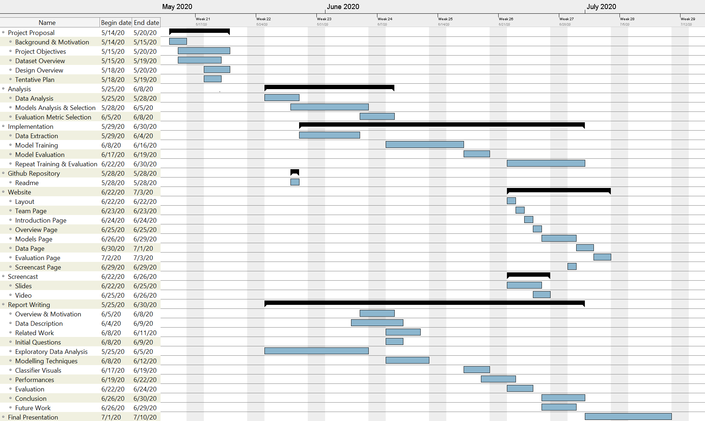

<div class="mycontent">

```{r setup, include=FALSE}
knitr::opts_chunk$set(echo = TRUE)


```


<!-- <center> -->

<!--  -->

<!-- </center> -->

## Background

 *Data Science* could be one solution for the majority of the problems we face in our daily lives. Which includes analyzing the problem, applying different possible methodologies to solve the problem and finally suggesting a best outcome which will be essential in solving the problem or improving the present situation. In this analysis process **Data** plays an important role, having relevant and abundant data helps us to understand the underlying problems by using various analysis techniques and helps us to generate insightful patterns to solve the issue.

The data which we acquired from the *IWD* market research organization contains survey information about the Customers on the leading supermarkets all over Germany. The survey includes several questions on general grocery, frequently purchased items, customer satisfaction on product groups and shopping center, supermarket Loyalty index etc.

***

## Motivation

  As rightly said by **Steve Jobs**  – "_Get closer than ever to your customers. So close that you tell them what they need well before they realize it themselves.”_  To attract customers you as an enterprise need to get as close as possible to them. Supermarket business face a crisis of loyal customers.  Our **Problem Statement** - Improving customer Loyalty towards their supermarket. Takes us close to the customers and helps us understand their shopping patterns and supermarket visiting patterns. Which will in turn help us analyze the problem and suggest a possible solution to improve the Problem.
  
***

## Project Objectives

2303 customers have reported their satisfaction about different aspects of the supermarket.

* One of the objectives is to identify and group the customers based on their satisfaction levels. These groups are identified by filtering **relevant** factors or information from the raw data and apply a **clustering methods** to identify customers with similar satisfaction level.

* Most of the customers reported their overall satisfaction value on a Likert scale from 4 to 5. Which is kind of a **naive** representation and not reliable. We need a more nuanced multi-dimensional metric which is more practical and generalizes the customer satisfaction. There are several factors where the customers are highly satisfied and some factors they are not satisfied. These are **interesting** factors. We need this information in our metric calculation. One possible solution is to find the **mean** of all interesting factors and report this satisfaction value as the value of our metric.

* By achieving the above two objectives we are now able to understand what are the factors that are relevant for customer satisfaction. So, we can recommend a supermarket to a new customer if he falls under a certain customer subgroup.

* A supermarket may not be perfect in every product groups. A supermarket can have high score based on a specific product group like sweets & snacks. While another supermarket has received a low rating because of some product group, but the other product groups are exceptional. So, it is necessary to identify for a particular supermarket, which product groups are highly good and which product groups are highly bad.

* We need to identify the customers' way of shopping. For example, some customers buy products based on the product quality, some will buy products based on price etc. We can do this by analyzing priorities of different customers.

***

## Description about Dataset 

We are working on the Dataset from the IWD market research Organization. IWD is an international retail market research Organization which has clients from the leading stores in Germany. IWD has conducted an On-site survey on Customers from their leading Clients.  The dataset comprise of a series of Questions regarding the Stores from various prospective ranging from the Customer loyalty to Demographic information. We would like to provide insights about the dataset in below sections.

The Dataset comprise of Questions from 10 Blocks, the key points and most valuable feature i.e questions from these 10 Blocks are listed below.

* Block-1: **Customer Information**
  + The block has questions regarding Customer’s Age, region which can be used to **for customer segmentation**.


* Block-2: **General Grocery Shopping**
  + This block comprise of 5 questions which helps to find the *shopping patterns of the customers* and also helps *to estimate the amount spent by an household on grocery*.  After understanding the patterns of customers we are also working on *potential reasons for Customers to choose certain stores as “Main Shopping Store”.*

  
* Block-3: **Groups of Goods Purchased**
  + This block helps to extract most commonly purchased items in store. It can used to find the **frequent purchase list**   which can be used for **Recommendations to improve business** and also helps to trace whether any **store don’t have an adequate stock of any particular category of products which customer require**.


* Block-4: **Satisfaction Main Shopping Center**
  + This block consists of a couple of questions which helps to figure out **Customer satisfaction with respect to a branch**, this data can be used to **cluster the branches into categories**. Later find out key elements which make these branches **Customer Friendly**.

  
* Block-5: **Customer Loyalty**
  + The block comprise of questions related to the user opinion regarding their **recommendations**.  Also helps to get a clear idea on the **Customer Loyalty** and helps to find out the **Retention rate of the customers in various branches**.

  
* Block-6: **Individual satisfaction Product Groups**
  + This is the fundamental block which helps to get **a clear picture of the store from customer point of view** based on 26 categories of products ranging from Food to Personal care. With this data we have now the potential to **Segment and find the taste of customers** in various branches, for example there are branches where the Customers feel the store don’t have adequate variety of Alcoholic beverages.
    + Cluster stores based on categories.
    + Find the clusters which are best suited to experiment with new products and tracking the consumption rate in these stores helps to take Business Decisions.
    + Monitor and improve categories which are not satisfied by the Customers.
  + We are planning to perform **SWOT Analysis** for each store based answers given by customers for this particular block.

  
* Block-7: **Branch Satisfaction**
  + The block helps to get the **satisfaction rate**. Some of the key parameters which we consider are.
    + Ambience
    + Speed of Checkout process
    + Waiting Time
    + Price labelling
    + Friendliness and Availability of Employees
    + Location of Branch
    + Reachability of store by public transport
    + Arrangement and Assortment of Products i.e.  Market Basket Analysis

  
* Block-8: **Online Purchase of food**
  + This block helps to find the **probability and scope** for **online food business**. But the data is not enough to project the Business feasibility.

  
* Block-9: **Price and Quality**
  + The questionnaire in this block helps to find the Customers priority in a **tradeoff between price and quality**. This data can be useful as a guide to **improve business** and make **better investments**.

  
* Block: 10: **Demographic Data**
  + This block describes the demographic data about the Customers.

***

## Design Overview

The current project goals are as follows.

* Customer segmentation
* Customer Satisfaction index development
* Customer Satisfaction Vs Recommendation potential

As the dataset is categorized well providing a good abstract for analyzing the customer responses we decided to proceed are as follows.

For **Customer segmentation** blocks such as main shopping center satisfaction, shop layout satisfaction and few more describe the customer satisfaction level. As the initial step we average the responses in each block, extract them as features and apply the clustering algorithm on the features. With we will be able to get labels for satisfied customers and unsatisfied customers. 
Below images show how the customers responded to different kinds of shopping
<br><br>
Dataset Load and Feature 1 extraction - main shop satisfaction
```{r, results='hide', message=FALSE} 
#install.packages("tidyverse")
#Dataset Load
library(haven)
customerdata <- read_sav(choose.files())
msc_cols <- c("F7_1_ZUFRIEDEN_1", "F7_2_ERWARTUNGEN_1","F7_3_IDEAL_1")
library(dplyr)

#Feature 1 extraction - main shop satisfaction
msc_df <- customerdata[msc_cols]
msc_df <- msc_df %>%
  replace(is.na(.), 0) %>%
  mutate(main_shop_satisfaction = rowSums(msc_df)/ncol(msc_df))
msc<-(msc_df[c("main_shop_satisfaction")])
```

Feature 2 extraction - Branch Employee satisfaction and plotting
```{r, fig.height=4,fig.width=10} 
#Feature 2 extraction - Branch Employee satisfaction and plotting
br_emp_sat_cols <- c("F28_1_MA_FREUNDLICHKEIT_1","F28_2_MA_KOMPETENT_1","F28_3_MA_VERFUEGBARKEIT_1")
br_emp_sat_df <- customerdata[br_emp_sat_cols]
br_emp_sat_df <- br_emp_sat_df %>%
  replace(is.na(.), 0) %>%
  mutate(br_emp_satisfaction = rowSums(br_emp_sat_df)/ncol(br_emp_sat_df))
br_emp_sat<-(br_emp_sat_df[c("br_emp_satisfaction")])
par(mfrow=c(1,2))
hist(msc$main_shop_satisfaction, main="F1-Main Shop Satisfaction", xlab = "Ratings")
hist(br_emp_sat$br_emp_satisfaction, main="F2-Branch Employee Satisfaction", xlab = "Ratings")

```


Feature 3 extraction - Findability satisfaction
```{r}
#Feature 3 extraction - Findability satisfaction
findability_cols <-c("F33_1_AUFFINDBARKEIT_SCHNELLIGKEIT_1","F33_2_AUFFINDBARKEIT_AUSSCHILDERUNG_1")

findability_df <- customerdata[findability_cols]
findability_df <- findability_df %>%
  replace(is.na(.), 0) %>%
  mutate(findability_satisfaction = rowSums(findability_df)/ncol(findability_df))
findability<-(findability_df[c("findability_satisfaction")])


```


Feature 4 extraction - Price Label satisfaction and plotting
```{r, fig.height=4,fig.width=10}
#Feature 4 extraction - Price Label satisfaction and plotting
price_Lab_cols <- c("F34_1_PREIS_RICHTIG_1","F34_2_PREIS_ZUORDNUNG_1","F34_3_PREIS_INFORMATIONEN_1")
price_Label_sat_df <- customerdata[price_Lab_cols]

price_Label_sat_df <- price_Label_sat_df %>%
  replace(is.na(.), 0) %>%
  mutate(price_Label_satisfaction = rowSums(price_Label_sat_df)/ncol(price_Label_sat_df))
price_Label_sat<-(price_Label_sat_df[c("price_Label_satisfaction")])
par(mfrow=c(1,2))
hist(findability$findability_satisfaction, main="F3 - Findability Satisfaction", xlab = "Ratings")
hist(price_Label_sat$price_Label_satisfaction, main="F4 - Price Label Satisfaction", xlab = "Ratings")

```

Box plots for Feature Data
```{r, results='hide', fig1, fig.height=5,fig.width=10, message=FALSE}
# Box plots for Feature Data
features <- cbind(msc, br_emp_sat, findability, price_Label_sat)
library(reshape)
boxplot(features, main="Features Box Plot")

```


Clustering on Feature Data
```{r, results='hide', fig.width=9}
# Clustering on Feature Data
(cl <- kmeans(features, 3, nstart = 25))
plot(features, col = cl$cluster)


```

```{r, results='hide'}


```

The above images show the average of responses from four blocks. First image is plotted from the data of main shopping center satisfaction. Even though this gives the high level answer for the customer satisfaction this is not completely reliable as some other responses in the other blocks contradict it. For the same reason we took some other blocks data as features such as findability satisfaction and price level satisfactions responses. As we mentioned for the initial proceeding we take each block data averaging them, extract them as features, get the ground truth and later proceed with finding more deep patterns in subgrouping the customers.


In the image 5 the box plots illustrate the outliers which are unwanted responses and the other values and the box represents where most of the customers are gives good ratings for each feature. For the four features extracted a clustering algorithm was applied to form 3 clusters representing highly satisfied customers, satisfied customers and non-satisfied customers. This is the first initial analysis done and tried to understand how the features were contributing and as the next steps we will proceed with finding more patterns using the demographic data and individual product ratings.

```{r} 


```


For **Customer Satisfaction index development** with respect to supermarket, here extracting the features with respect to supermarket will be done. Data from block 6 gives the neat data about the products in the markets and their ratings helps to build the good features for Customer Satisfaction Index.


The final objective of the project **Customer Satisfaction Vs Recommendation potential** here the relation between the features from first objective and second objective is studied to get features. The product ratings give chance to build a new metric development with respect to product. With features based on products and market with a good model it should be able to predict a suitable market for customer with specific product need.

***

## Time Plan

*Timelines* are crucial part of any project. It helps in tasks distribution and allocation of the resources such that the resources can be utilized in an efficient with. It also helps in maximizing the efficiency of a team. It assists in foreseeing the dependencies and bottle necks that a team faces in a project. Last but not least, it is inevitable in tracking the progress and meeting the deadlines. 


*Project Timeline* image below shows our team’s planning in achieving different tasks. It is a tentative timeline. It shows different tasks and their details at granular level. All the tasks has been organized in a way that they should not conflict. Some tasks have dependencies, therefore, the dependent tasks are scheduled with buffer time so that the proceeding tasks must not face any hindrance in terms of data and knowledge that they expect from the respective preceding task(s). The timeline has been split into different phases, Project Proposal, Analysis, Implementation, Repository, Website, Report Writing, and Final Presentation. These tasks are then further sub-divided into sub-tasks. 3P-Estimation (Three Point Estimation) is a well-known and widely used estimation criteria for deciding the milestone, therefore, in this timeline we choose ‘Most-Likely’ estimates. (Best and Worst case are not considered in this timeline).


[You can find a clear Image of the *Project Timeline* on our github repo](https://github.com/ravi419/DataScienceWithR---Market-Research/blob/master/ProposalMarkdown/Timeline.png)

<center>


</center>

&nbsp;
<hr />
<p style="text-align: center;"> Work by Data Science Cubs</a></p>

<!-- Add icon library -->
<link rel="stylesheet" href="https://cdnjs.cloudflare.com/ajax/libs/font-awesome/4.7.0/css/font-awesome.min.css">

<!-- Add font awesome icons -->
<p style="text-align: center;">
    <a href="https://github.com/ravi419/DataScienceWithR---Market-Research.git" class="fa fa-github"></a>
</p>

&nbsp;

</div>
